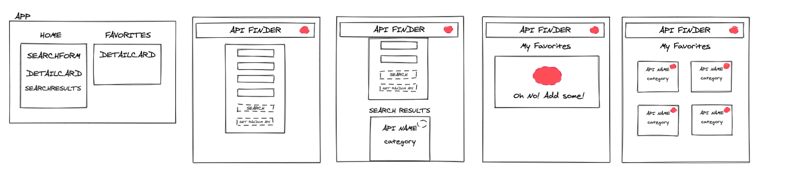

# Binary-Challenge
- [Project Spec](https://frontend.turing.io/projects/module-3/binary-challenge.html)
  - Pick an Audience: Students
  - Pick an API: [Public-Api](https://github.com/davemachado/public-api)
  - MVP: Display data from the API & Allow data manipulation

## About This Project


This modest project application build allows a user to select from a drop-down of categories and see the details of each API for that category. They can also have fun with it and just randomly generate an API. Each detail card allows the user to favorite it for reference later! The selected cards can be seen in the favorites view. 

This final project for Mod 3 of Turing's Frontend program was a challenge because of how open it could be. My understanding of React components passing props and setting state grew a great deal as well as using asynchronous javaScript functions. I was able to successfully implement Router to switch between my Home and Favorites pages. 


## Installation
  1. Clone the repo down ```git clone git@github.com:Estaffieri/binary-challenge.git```
  2. Install NPM dependancies ```npm install```
  3. Start application ```npm start```

This project was bootstrapped with [Create React App](https://github.com/facebook/create-react-app).


